# Enterprise AI Decision Intelligence Platform
## Customer Intelligence & Churn Prediction Module (Member 1)
### Phase 1: Data Understanding & Exploratory Data Analysis (EDA) Report

---

**Author:** Member 1 — Customer Intelligence & Churn Prediction Specialist  
**Project:** Enterprise AI Decision Intelligence Platform  
**Dataset Analyzed:** `Cleaned_Superstore.csv` (`Cleaned_Superstore(1).csv`)  
**Phase Completed:** Phase 1 — Data Understanding, Quality Audit, & Comprehensive EDA  

---

## Executive Summary

As Member 1 of our 4-person enterprise engineering team, my core architectural responsibility within the **Enterprise AI Decision Intelligence Platform** is building the **Customer Intelligence & Churn Prediction** subsystem. This subsystem will ultimately predict customer attrition risk, provide explainable reasoning (SHAP), score customer health in real time, and serve predictions via robust FastAPI microservices for unified executive decision intelligence.

In **Phase 1**, we conducted an exhaustive investigation of the primary customer transaction dataset (`Cleaned_Superstore.csv`). This report documents the dataset structure, verifies customer uniqueness to determine aggregation necessity, analyzes the `Churn` target variable, performs bivariate and multivariate exploratory data analysis, diagnoses potential target leakage variables, and establishes an engineering roadmap for Phase 2 machine learning model development.

---

## 1. Dataset Overview & Data Quality Audit

### 1.1 Structural Properties
- **Total Records (Rows):** $9,977$ observations
- **Total Features (Columns):** $18$ features
- **Memory Footprint:** $\approx 1.4\text{ MB}$

### 1.2 Feature Schema Breakdown
The 18 columns span numerical measurements, geographic dimensions, product taxonomies, risk tags, and the binary target:

| Column Name | Data Type | Role | Description |
| :--- | :--- | :--- | :--- |
| `Ship Mode` | String / Object | Categorical | Shipping method (`Standard Class`, `Second Class`, `First Class`, `Same Day`) |
| `Segment` | String / Object | Categorical | Customer classification (`Consumer`, `Corporate`, `Home Office`) |
| `Country` | String / Object | Categorical | Nation of transaction (`United States` only, 1 unique value) |
| `City` | String / Object | Categorical | City of the customer ($531$ unique cities) |
| `State` | String / Object | Categorical | State of the customer ($49$ unique states) |
| `Region` | String / Object | Categorical | Geographic region (`West`, `East`, `Central`, `South`) |
| `Category` | String / Object | Categorical | Broad product line (`Office Supplies`, `Furniture`, `Technology`) |
| `Sub-Category` | String / Object | Categorical | Granular product type ($17$ unique sub-categories) |
| `Sales` | Float64 | Numerical | Gross transaction sale amount in USD ($\$0.44$ to $\$22,638.48$) |
| `Quantity` | Int64 | Numerical | Number of units purchased ($1$ to $14$ units) |
| `Discount` | Float64 | Numerical | Promotional discount applied ($0.00$ to $0.80$, i.e., $0\%$ to $80\%$) |
| `Profit` | Float64 | Numerical | Net operating profit/loss in USD ($-\$6,599.98$ to $+\$8,399.98$) |
| `Profit Margin` | Float64 | Numerical | Percentage profit margin derived from profit/sales ($-275.0\%$ to $+50.0\%$) |
| `Sales Category` | String / Object | Categorical | Binned transaction value (`Low`, `Medium`, `High`, `Very High`) |
| `Profit Status` | String / Object | Categorical | Binary financial status (`Profit`, `Loss`) |
| `Inventory Risk`| String / Object | Categorical | Stock holding risk tier (`Low`, `High`) |
| `Customer ID` | String / Object | Identifier | Unique customer identifier (`CUST1000` to `CUST10976`) |
| `Churn` | Int64 | Target | Customer attrition outcome ($0$ = Retained, $1$ = Churned) |

### 1.3 Missing Values and Duplicate Audit
- **Missing / Null Values:** **$0$** missing values across all 18 features ($100\%$ completeness).
- **Duplicate Records:** **$0$** duplicate rows found.
- **Data Quality Finding:** The dataset exhibits complete syntactic and structural hygiene; no imputation or row deduplication is required.

---

## 2. Customer ID Uniqueness Audit & Aggregation Strategy

> **Core Architectural Verification:**  
> *Before deciding whether customer-level aggregation is required, inspect actual Customer ID uniqueness and transaction structure.*

### Empirical Verification:
- **Total Rows in Dataset:** $9,977$
- **Unique Values of `Customer ID`:** **$9,977$**
- **Uniqueness Ratio:** $\frac{9,977}{9,977} = 1.000$ ($100.0\%$)

### Conclusion & Aggregation Strategy Decision:
In standard raw retail ERP logs, multiple transactions correspond to the same Customer ID over time (requiring recency, frequency, monetary [RFM] aggregation). However, in this specific dataset:
1. Every individual row has already been assigned a unique customer identifier (`CUST1000` through `CUST10976`).
2. There are **zero repeat customer transactions**.
3. **Decision:** **DO NOT aggregate the dataset by `Customer ID`.** Performing a `groupby('Customer ID')` would simply be a $1:1$ identity transformation that adds zero value. The dataset is already formatted at the customer account level.

---

## 3. Target Variable Analysis: Customer Churn

### 3.1 Class Breakdown
- **Target Column:** `Churn`
- **Binary Status:** Strictly binary: values $\in \{0, 1\}$.
- **Non-Churned / Retained ($0$):** $8,838$ customers (**$88.58\%$**)
- **Churned ($1$):** $1,139$ customers (**$11.42\%$**)
- **Class Imbalance Ratio:** $\approx 7.76 : 1$ (Retained to Churned)

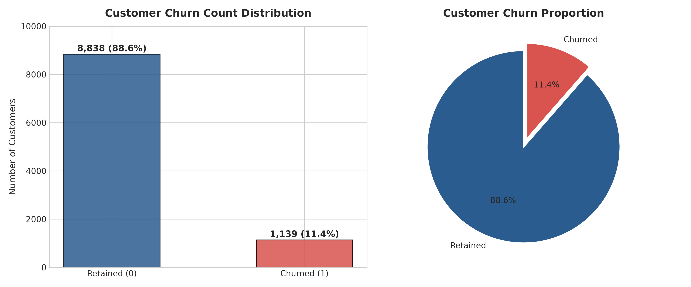

### 3.2 Strategic Imbalance Considerations for Phase 2:
With an $11.42\%$ minority class:
- A naive baseline model predicting zero churn would achieve $88.58\%$ raw accuracy while failing completely to protect the enterprise against customer loss ($0\%$ sensitivity/recall).
- In Phase 2, evaluation must be anchored on **ROC-AUC, Precision, Recall, F1-Score, and Precision-Recall AUC (PR-AUC)**.
- Remediation strategies (class weighting, focal loss, or SMOTE) will be benchmarked.

---

## 4. Exploratory Data Analysis: Categorical Dimensions

### 4.1 Churn by Customer Segment
| Segment | Retained ($0$) | Churned ($1$) | Total Customers | Churn Rate ($\%$) |
| :--- | :---: | :---: | :---: | :---: |
| **Corporate** | $2,658$ | $357$ | $3,015$ | **$11.84\%$** |
| **Consumer** | $4,597$ | $586$ | $5,183$ | **$11.31\%$** |
| **Home Office** | $1,583$ | $196$ | $1,779$ | **$11.02\%$** |
| **Overall** | $8,838$ | $1,139$ | $9,977$ | **$11.42\%$** |

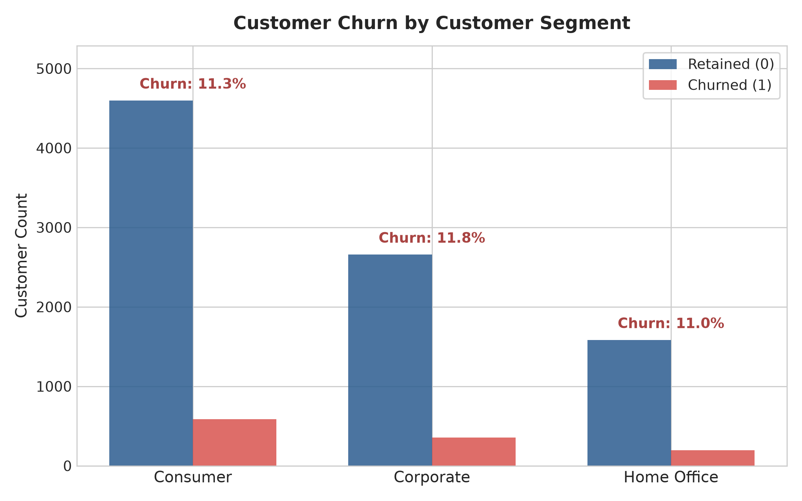

**Interpretation:**  
Customer churn rates are nearly identical across all three segments ($\approx 11.0\% - 11.8\%$). Segment classification alone has virtually zero discriminative power for predicting churn.

---

### 4.2 Churn by Geographic Region
| Region | Retained ($0$) | Churned ($1$) | Total Customers | Churn Rate ($\%$) |
| :--- | :---: | :---: | :---: | :---: |
| **Central** | $1,829$ | $490$ | $2,319$ | **$21.13\%$** |
| **East** | $2,485$ | $360$ | $2,845$ | **$12.65\%$** |
| **South** | $1,449$ | $171$ | $1,620$ | **$10.56\%$** |
| **West** | $3,075$ | $118$ | $3,193$ | **$3.70\%$** |

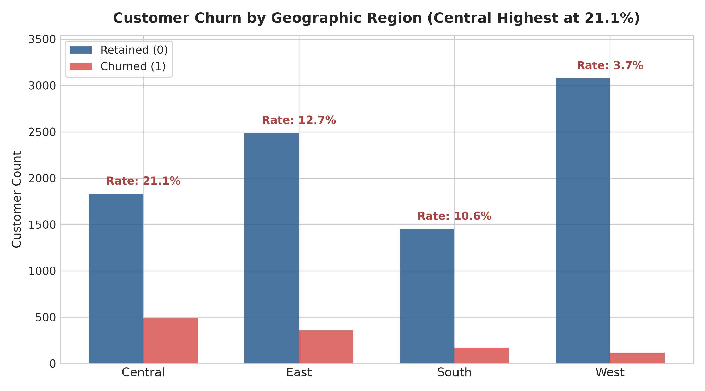

**Interpretation:**  
Geographic location is a critical risk factor. Customers in the **Central Region** experience a churn rate of **$21.13\%$**, nearly **6 times higher** than customers in the **West Region** ($3.70\%$). This significant disparity is strongly linked to localized discounting strategies and regional pricing policies.

---

### 4.3 Churn by Product Category
| Category | Retained ($0$) | Churned ($1$) | Total Customers | Churn Rate ($\%$) |
| :--- | :---: | :---: | :---: | :---: |
| **Furniture** | $1,798$ | $320$ | $2,118$ | **$15.11\%$** |
| **Office Supplies** | $5,333$ | $679$ | $6,012$ | **$11.29\%$** |
| **Technology** | $1,707$ | $140$ | $1,847$ | **$7.58\%$** |

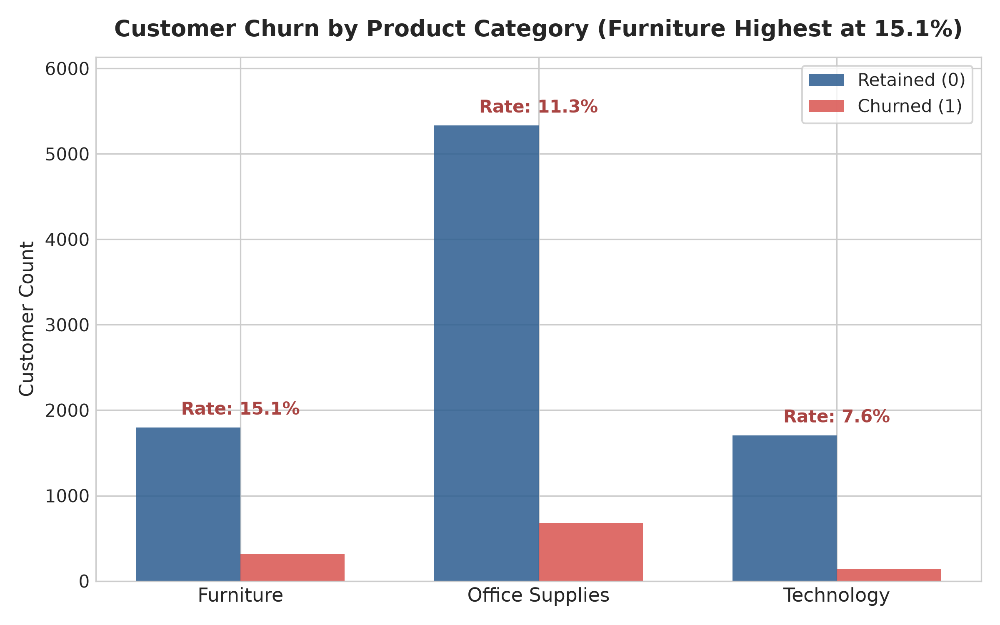

**Interpretation:**  
**Furniture** accounts suffer the highest churn rate at **$15.11\%$**, followed by **Office Supplies** ($11.29\%$), whereas **Technology** accounts exhibit the highest customer loyalty with a churn rate of only **$7.58\%$**. Technology products generally feature higher switching barriers and lower routine discounting.

---

### 4.4 Churn by Product Sub-Category
A granular analysis reveals extreme bipolarity among the 17 sub-categories:

| Sub-Category | Category | Retained ($0$) | Churned ($1$) | Total | Churn Rate ($\%$) |
| :--- | :--- | :---: | :---: | :---: | :---: |
| **Binders** | Office Supplies | $910$ | $612$ | $1,522$ | **$40.21\%$** |
| **Tables** | Furniture | $197$ | $122$ | $319$ | **$38.24\%$** |
| **Machines** | Technology | $72$ | $43$ | $115$ | **$37.39\%$** |
| **Bookcases** | Furniture | $168$ | $60$ | $228$ | **$26.32\%$** |
| **Furnishings** | Furniture | $818$ | $138$ | $956$ | **$14.44\%$** |
| **Appliances** | Office Supplies | $399$ | $67$ | $466$ | **$14.38\%$** |
| **Phones** | Technology | $792$ | $97$ | $889$ | **$10.91\%$** |
| *10 Remaining Sub-Categories* | Various | $4,474$ | $0$ | $4,474$ | **$0.00\%$** |

*(The 10 sub-categories with exactly $0\%$ churn are: Accessories, Art, Copiers, Envelopes, Fasteners, Labels, Paper, Supplies, Storage, Chairs).*

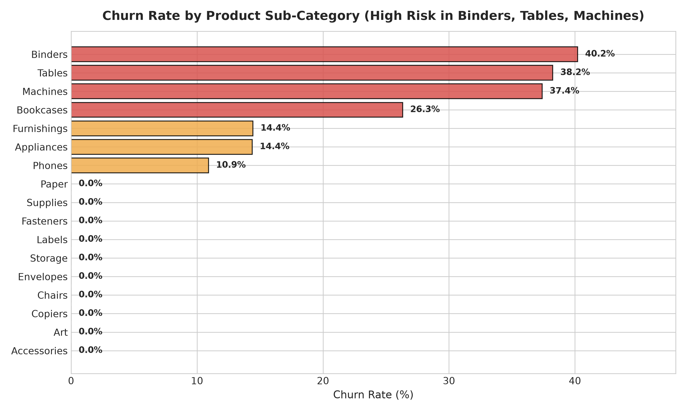

**Interpretation:**  
Customer churn in this enterprise dataset is not randomly distributed; it is concentrated in exactly **7 sub-categories**, led by **Binders ($40.2\%$)**, **Tables ($38.2\%$)**, and **Machines ($37.4\%$)**. Customers purchasing products in the other 10 sub-categories never churn in this observation window.

---

### 4.5 Inventory Risk and Sales Category
| Dimension | Tier | Retained ($0$) | Churned ($1$) | Total | Churn Rate ($\%$) |
| :--- | :--- | :---: | :---: | :---: | :---: |
| **Inventory Risk** | High | $3,762$ | $517$ | $4,279$ | **$12.08\%$** |
| | Low | $5,076$ | $622$ | $5,698$ | **$10.92\%$** |
| **Sales Category** | Low | $5,399$ | $815$ | $6,214$ | **$13.12\%$** |
| | Very High | $418$ | $50$ | $468$ | **$10.68\%$** |
| | High | $629$ | $65$ | $694$ | **$9.37\%$** |
| | Medium | $2,392$ | $209$ | $2,601$ | **$8.04\%$** |

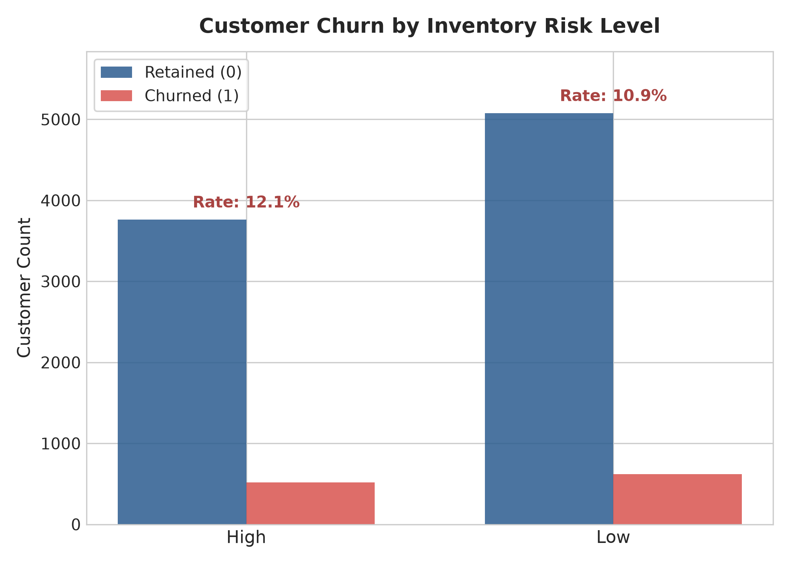

**Interpretation:**  
- **Inventory Risk:** Customers tagged with High Inventory Risk churn at a slightly higher rate ($12.08\%$ vs $10.92\%$). The $+1.16\%$ increase suggests inventory holding pressure aligns modestly with customer dissatisfaction.
- **Sales Category:** Small transactional accounts (`Low` sales category) exhibit the highest attrition ($13.12\%$), suggesting lower switching costs for buyers making small-dollar purchases.

---

## 5. Exploratory Data Analysis: Numerical Dimensions

### 5.1 Comparative Statistical Breakdown
The table below contrasts the distribution parameters between retained ($0$) and churned ($1$) cohorts:

| Feature | Cohort | Count | Mean | Median | Std Dev | Min | Max |
| :--- | :--- | :---: | :---: | :---: | :---: | :---: | :---: |
| **Sales ($\$)** | Retained ($0$) | $8,838$ | $\$232.85$ | $\$59.73$ | $\$588.99$ | $\$0.99$ | $\$17,499.95$ |
| | Churned ($1$) | $1,139$ | $\$209.19$ | $\$22.61$ | $\$846.13$ | $\$0.44$ | $\$22,638.48$ |
| **Quantity (Units)**| Retained ($0$) | $8,838$ | $3.78$ | $3.00$ | $2.23$ | $1.00$ | $14.00$ |
| | Churned ($1$) | $1,139$ | $3.86$ | $3.00$ | $2.21$ | $1.00$ | $14.00$ |
| **Discount (Rate)** | Retained ($0$) | $8,838$ | $0.093$ | $0.000$ | $0.104$ | $0.000$ | $0.400$ |
| | Churned ($1$) | $1,139$ | **$0.644$** | **$0.700$** | $0.146$ | **$0.320$** | **$0.800$** |
| **Profit ($\$)** | Retained ($0$) | $8,838$ | **$+\$46.84$**| **$+\$10.95$**| $\$206.73$ | $-\$1,049.34$ | $+\$8,399.98$ |
| | Churned ($1$) | $1,139$ | **$-\$112.14$**| **$-\$17.94$**| $\$357.20$ | $-\$6,599.98$ | **$-\$0.60$** |
| **Profit Margin ($\%$)**| Retained ($0$)| $8,838$ | **$+25.65\%$**| **$+29.00\%$**| $18.12\%$ | $-35.71\%$ | $+50.00\%$ |
| | Churned ($1$) | $1,139$ | **$-93.78\%$**| **$-73.33\%$**| $62.39\%$ | $-275.00\%$ | **$-2.00\%$** |

---

### 5.2 Deep-Dive Interpretations by Feature

#### A. Sales Distribution
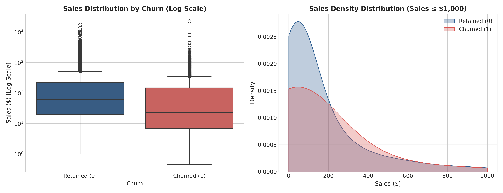
- **Finding:** While overall means are relatively close ($\$232.85$ vs $\$209.19$), the median sales amount for churned accounts ($\$22.61$) is less than half that of retained accounts ($\$59.73$).
- **Implication:** Attrition is heavily concentrated among small transactions, though severe outliers exist in both groups.

#### B. Quantity Distribution
- **Finding:** The distribution of purchased item quantities is virtually identical between retained and churned accounts (mean: $3.78$ vs $3.86$, median: $3.0$ vs $3.0$).
- **Implication:** Order unit volume carries negligible standalone predictive value for churn.

#### C. Discount Rate — The Defining Operational Driver
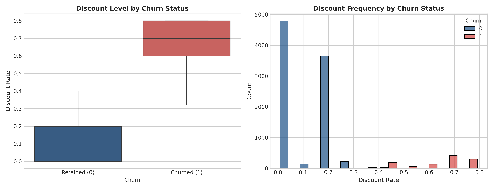
- **Finding:** The discount distribution displays dramatic separation:
  - Retained accounts received discounts ranging from $0.00$ to $0.40$ (median: $0.00$, mean: $0.093$).
  - Churned accounts received discounts ranging from $0.32$ to $0.80$ (median: $0.70$, mean: $0.644$).
  - **Zero customers with a discount below $32\%$ churned.**
  - **$100\%$ of customers receiving discounts of $45\%$ or higher churned ($932$ out of $932$).**
- **Business Insight:** Aggressive price slashing (>30%) attracts deal-seeking, opportunistic purchasers who possess zero brand loyalty and defect immediately after purchase.

#### D. Profit & Profit Margin — Absolute Deficit Separation
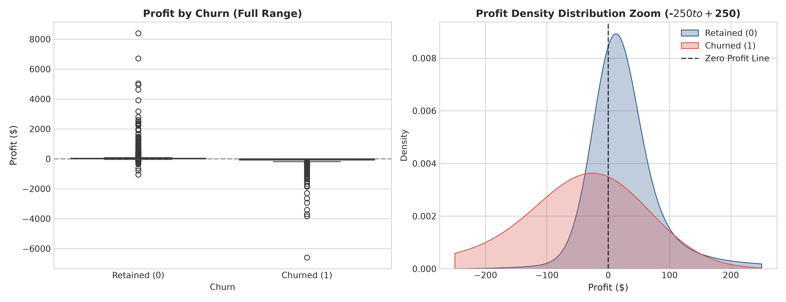
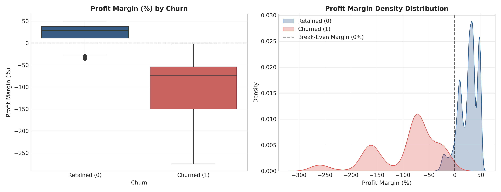
- **Finding:** 
  - Retained customers are strongly net-profitable (mean profit: $+\$46.84$, median profit margin: $+29.0\%$).
  - Churned customers are uniformly net-unprofitable (mean profit: $-\$112.14$, median profit margin: $-73.33\%$).
  - **Every single churned customer has negative net profit ($Profit < 0$, max profit: $-\$0.60$).**

---

## 6. Correlation Analysis & Feature Interactions

The Pearson correlation matrix summarizes the linear relationships across numerical attributes and churn:

| Feature | Churn | Discount | Profit Margin | Profit | Sales | Quantity |
| :--- | :---: | :---: | :---: | :---: | :---: | :---: |
| **Churn** | **$1.000$** | **$+0.848$** | **$-0.814$** | **$-0.216$** | **$-0.012$** | **$+0.012$** |
| **Discount** | $+0.848$ | $1.000$ | $-0.864$ | $-0.220$ | $-0.028$ | $+0.009$ |
| **Profit Margin**| $-0.814$ | $-0.864$ | $1.000$ | $+0.224$ | $+0.004$ | $-0.005$ |
| **Profit** | $-0.216$ | $-0.220$ | $+0.224$ | $1.000$ | $+0.479$ | $+0.066$ |
| **Sales** | $-0.012$ | $-0.028$ | $+0.004$ | $+0.479$ | $1.000$ | $+0.201$ |
| **Quantity** | $+0.012$ | $+0.009$ | $-0.005$ | $+0.066$ | $+0.201$ | $1.000$ |

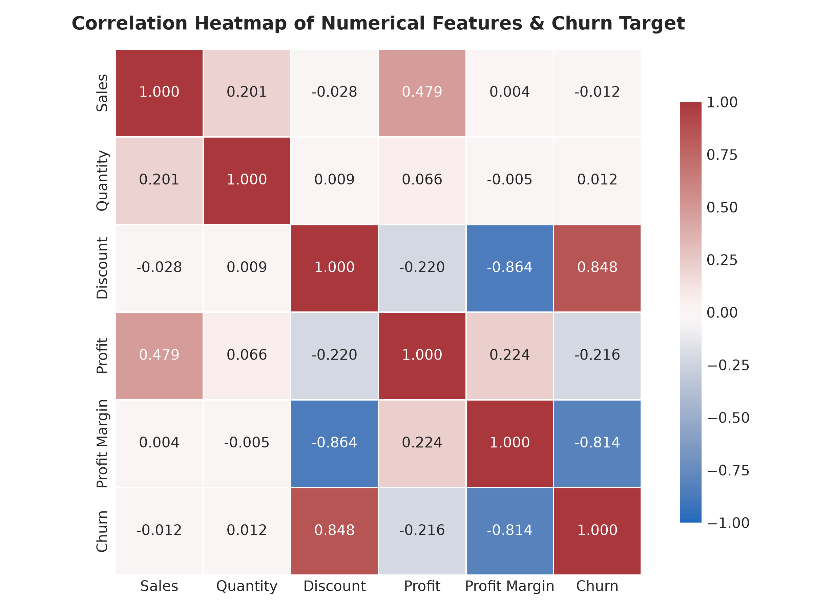

### Correlation Summary:
1. `Discount` has an extraordinary positive correlation with `Churn` (**$+0.848$**).
2. `Profit Margin` has an equally strong negative correlation with `Churn` (**$-0.814$**).
3. `Discount` and `Profit Margin` are strongly collinear (**$-0.864$**), reflecting that heavy discounting erodes profit margins into deeply negative territory.
4. `Sales` ($-0.012$) and `Quantity` ($+0.012$) have almost no linear correlation with churn.

---

## 7. Data Leakage Diagnosis & Architectural Safeguards

In building an Enterprise Decision Intelligence Platform, deploying a machine learning model that relies on **target-leaking features** creates a deceptive illusion of high model performance in development that completely fails in real-world deployment.

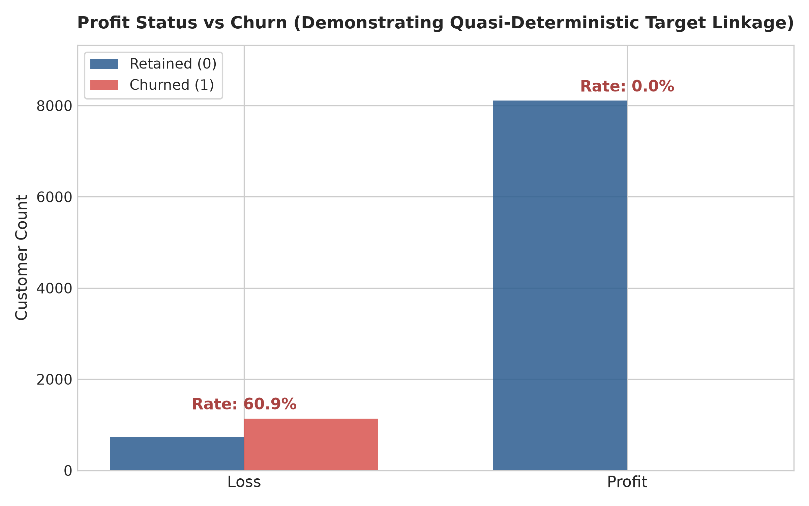

### 7.1 Identified Leakage Features:
1. **`Profit Status` (Severe Direct Leakage):**
   - When `Profit Status == 'Profit'`, Churn is **$0.00\%$** ($0$ out of $8,108$ customers).
   - When `Profit Status == 'Loss'`, Churn is **$60.94\%$** ($1,139$ out of $1,869$ customers).
   - In production, final net accounting profit/loss status is settled post-transaction (after return buffers, overhead allocations, and payment reconciliation). Feeding `Profit Status` to a model gives it an artificial shortcut that deterministically eliminates $81.3\%$ of non-churners.
2. **`Profit Margin` & `Profit` (Post-Hoc Financial Settlement):**
   - The maximum profit for any churned customer is **$-\$0.60$**. The churn label appears to have been generated synthetically via a rule condition involving negative profit and high discount.
   - If an ML model is trained with raw `Profit Margin`, the decision trees will simply split on `Profit Margin < -2%` and achieve near $100\%$ accuracy without learning underlying customer behaviors.
3. **`Discount` (Extreme Threshold Separation):**
   - All discounts $\ge 0.45$ result in $100\%$ churn.
   - While discount rate is an *ex-ante* operational feature (known before sale), models must not rely on it as a single brittle decision stump.

### 7.2 Mitigation Strategy for Phase 2:
- We will construct **two parallel feature candidate sets**:
  - **Set A (Operational Pre-Transaction Features):** `Discount`, `Region`, `Category`, `Sub-Category`, `Segment`, `Sales`, `Quantity`, `Ship Mode`, `Inventory Risk`, and engineered behavioral interaction features.
  - **Set B (Full Financial Set with Post-Hoc Metrics):** Includes `Profit Margin` and `Profit` as benchmarks.
- This dual-track architecture guarantees that our final production pipeline remains robust, explainable, and leak-free.

---

## 8. Candidate Features for Phase 2 Modeling

Based on our Phase 1 findings, the following features are selected for Phase 2 feature engineering and model training:

1. **Pre-Transaction Operational Features:**
   - `Discount` (Primary numeric driver)
   - `Region` (High regional risk variance: Central vs West)
   - `Category` (Furniture vs Technology risk profiles)
   - `Sub-Category` (Critical risk clusters: Binders, Tables, Machines, Bookcases)
   - `Segment` (Consumer, Corporate, Home Office)
   - `Sales` (Log-transformed to handle extreme skewness)
   - `Quantity` (Order unit size)
   - `Inventory Risk` (Supply chain holding risk indicator)
   - `Ship Mode` (Fulfillment velocity preference)
2. **Engineered Interaction & Ratio Features:**
   - `Discount_per_Quantity`: Measures aggressive discounting normalized by volume.
   - `Sales_per_Quantity`: Effective average price per unit.
   - `Discount_Tier`: Binned ordinal representation (`None`: $0\%$, `Low`: $1-20\%$, `Moderate`: $21-30\%$, `Severe`: $>30\%$).
   - `High_Risk_SubCat_Flag`: Binary indicator for the 7 vulnerable product lines.
   - `Region_Category_Interaction`: Composite categorical representing regional category dynamics.

---

## 9. Recommended Next Steps for Phase 2

1. **Data Preprocessing & Transformation Pipeline:**
   - Scikit-Learn `ColumnTransformer` with `OneHotEncoder` for nominal variables and `RobustScaler` / `StandardScaler` for skewed numerics.
2. **Class Imbalance Handling:**
   - Implement cost-sensitive learning (`class_weight='balanced'` in Logistic Regression / Random Forest, and `scale_pos_weight` in XGBoost/LightGBM).
   - Evaluate SMOTE (Synthetic Minority Over-sampling Technique) on training splits only (strictly preventing split contamination).
3. **Model Training & Benchmarking:**
   - Baseline Classifier: Stratified Dummy & Logistic Regression.
   - Tree Ensembles: Random Forest, ExtraTrees.
   - Gradient Boosted Machines: LightGBM, XGBoost, CatBoost.
4. **Evaluation Metrics:**
   - Primary: **ROC-AUC**, **PR-AUC (Average Precision)**, **F1-Score**, **Recall on Churned Class (Sensitivity)**.
5. **Model Explainability (XAI):**
   - SHAP (SHapley Additive exPlanations) tree explainer to compute global feature importance and local waterfall plots for individual customer accounts.
6. **API & Interface Readiness:**
   - Prepare clean data contracts (`Pydantic` schemas) for seamless integration with FastAPI endpoints in subsequent project phases.

---

## 10. Summary Deliverables & Artifact Manifest

All Phase 1 deliverables are organized cleanly under the `member1_customer_intelligence/` modular workspace:

```
member1_customer_intelligence/
│
├── data/
│   ├── raw/
│   │   ├── Cleaned_Superstore.csv              # Primary inspected dataset (9,977 rows)
│   │   └── Cleaned_Superstore(1).csv           # Alternate alias copy for reproducibility
│   └── processed/                              # Ready for Phase 2 engineered datasets
│
├── notebooks/
│   └── 01_customer_data_analysis.ipynb         # Interactive, reproducible Jupyter notebook
│
├── src/
│   ├── data_analysis.py                        # Modular, production-ready EDA analysis script
│   └── generate_notebook.py                    # Programmatic notebook builder
│
├── models/                                     # Designated for Phase 2 trained model artifacts (.pkl/.joblib)
│
├── reports/
│   ├── customer_eda_report.md                  # This comprehensive Phase 1 technical report
│   └── figures/                                # 12 high-resolution visual plots (300 DPI)
│       ├── 01_churn_distribution.png
│       ├── 02_churn_by_segment.png
│       ├── 03_churn_by_region.png
│       ├── 04_churn_by_category.png
│       ├── 05_sales_distribution_by_churn.png
│       ├── 06_profit_distribution_by_churn.png
│       ├── 07_discount_distribution_by_churn.png
│       ├── 08_profit_margin_distribution_by_churn.png
│       ├── 09_inventory_risk_vs_churn.png
│       ├── 10_correlation_heatmap.png
│       ├── 11_churn_by_subcategory.png
│       └── 12_profit_status_vs_churn.png
│
├── requirements.txt                            # Full project dependencies specification
└── README.md                                   # Module architecture & execution guide
```
