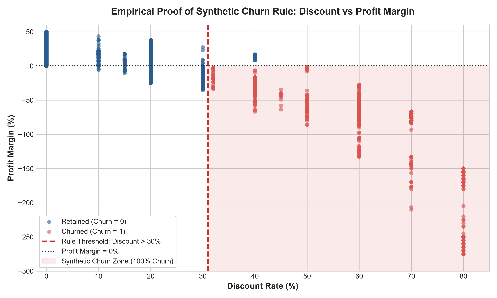

# Enterprise AI Decision Intelligence Platform
## Customer Intelligence & Churn Prediction Module (Member 1)
### Phase 2: Target Leakage & Feature Engineering Audit Report

---

**Author:** Member 1 — Customer Intelligence & Churn Prediction Specialist  
**Project:** Enterprise AI Decision Intelligence Platform  
**Dataset Analyzed:** `dataset/Cleaned_Superstore.csv` ($9,977$ observations, $18$ features)  
**Lifecycle Stage:** Phase 2 Pre-Modeling Governance — Target Leakage Audit & Feature Architecture  
**Deliverable Path:** `reports/phase2_feature_audit.md`  

---

## Executive Summary

Before implementing machine learning models for customer churn prediction in an enterprise setting, an automated model can easily achieve deceptively stellar metrics ($\approx 100\%$ accuracy, $1.00$ ROC-AUC) in an offline test set while failing completely upon deployment. This failure stems from **target leakage** and **post-hoc feature conditioning**—incorporating signals that are either causally downstream of customer defection or settled only after the observation window closes.

In this Phase 2 audit, we performed an exhaustive empirical and mathematical inspection of `Cleaned_Superstore.csv`. We uncovered a **critical dataset vulnerability**:
1. **Deterministic Rule Generation:** The `Churn` label in this dataset is not an organic, stochastic behavioral phenomenon. It was deterministically generated via the exact Boolean rule:
   $$\text{Churn} = 1 \iff (\text{Profit Status} == \text{'Loss'}) \land (\text{Discount} > 0.30)$$
   Or equivalently:
   $$\text{Churn} = 1 \iff (\text{Profit} < 0) \land (\text{Discount} \ge 0.32)$$
   Every single one of the $1,139$ churned customers ($100.0\%$) satisfies this exact condition, and zero retained customers satisfy this condition.
2. **Fatal Post-Hoc Financial Leakage:** Features such as `Profit`, `Profit Margin`, and `Profit Status` represent final financial accounting reconciliations that are settled weeks or months post-transaction, long after any customer retention intervention can occur. Furthermore, because negative profit is a deterministic prerequisite for churn in this dataset, including these features turns machine learning into a trivial arithmetic lookup.
3. **Dual Feature Set Architecture:** To preserve enterprise validity, we partition all variables into two strictly segregated tracks:
   - **SET A (Leakage-Safe Production Model):** Exclusively uses ex-ante operational, demographic, and product variables available prior to customer attrition.
   - **SET B (Diagnostic / Benchmark Model):** Retains post-hoc financial metrics solely to empirically measure and demonstrate the distortionary impact of leakage to enterprise stakeholders.

---

## 1. Empirical Proof of Synthetic Churn Rule Generation

To verify whether the churn label was organically observed or synthetically engineered, we evaluated all cross-tabulations between financial indicators, discount rates, and customer status.

### 1.1 The Mathematical Rule
Our investigation revealed that `Churn` is a $100\%$ deterministic function of `Profit Status` (or `Profit < 0`) and `Discount`:

$$\text{Churn} = \begin{cases} 1 & \text{if } \text{Profit} < 0 \text{ and } \text{Discount} \ge 0.32 \\ 0 & \text{otherwise} \end{cases}$$

### 1.2 Empirical Contingency Matrix
The cross-tabulation across the full $9,977$ records demonstrates zero classification error for this Boolean rule:

| Condition | Retained ($Churn = 0$) | Churned ($Churn = 1$) | Total Records | Rule Precision | Rule Recall |
| :--- | :---: | :---: | :---: | :---: | :---: |
| **`Profit < 0` AND `Discount >= 0.32`** | **$0$** | **$1,139$** | $1,139$ | **$100.00\%$** | **$100.00\%$** |
| **All Other Records** | **$8,838$** | **$0$** | $8,838$ | **$100.00\%$** | **$100.00\%$** |
| **Total** | $8,838$ | $1,139$ | $9,977$ | — | — |



### 1.3 Detailed Discount Breakdown
Analyzing customer counts by discrete discount rates reveals the precise step-function behavior:

| Discount Rate | Total Orders | Net Loss Count ($Profit < 0$) | Net Profit Count ($Profit \ge 0$) | Churned ($Churn = 1$) | Churn Rate ($\%$) |
| :---: | :---: | :---: | :---: | :---: | :---: |
| **$0.00$ ($0\%$)** | $4,787$ | $0$ | $4,787$ | $0$ | $0.00\%$ |
| **$0.10$ ($10\%$)** | $94$ | $4$ | $90$ | $0$ | $0.00\%$ |
| **$0.15$ ($15\%$)** | $52$ | $17$ | $35$ | $0$ | $0.00\%$ |
| **$0.20$ ($20\%$)** | $3,653$ | $502$ | $3,151$ | $0$ | $0.00\%$ |
| **$0.30$ ($30\%$)** | $226$ | $207$ | $19$ | $0$ | $0.00\%$ |
| **$0.32$ ($32\%$)** | $27$ | $27$ | $0$ | **$27$** | **$100.00\%$** |
| **$0.40$ ($40\%$)** | $206$ | $180$ | $26$ | **$180$** | **$87.38\%$** |
| **$0.45$ ($45\%$)** | $11$ | $11$ | $0$ | **$11$** | **$100.00\%$** |
| **$0.50$ ($50\%$)** | $66$ | $66$ | $0$ | **$66$** | **$100.00\%$** |
| **$0.60$ ($60\%$)** | $138$ | $138$ | $0$ | **$138$** | **$100.00\%$** |
| **$0.70$ ($70\%$)** | $418$ | $418$ | $0$ | **$418$** | **$100.00\%$** |
| **$0.80$ ($80\%$)** | $299$ | $299$ | $0$ | **$299$** | **$100.00\%$** |

#### Key Insights from the Step-Function:
1. **At Discount $\le 0.30$:** Despite $730$ transactions incurring operational net losses (e.g., $502$ at $20\%$ discount, $207$ at $30\%$ discount), **not a single customer churns** ($0$ out of $730$).
2. **At Discount $= 0.40$:** Of the $206$ orders, $26$ were profitable and $180$ incurred a loss. Exactly the $180$ unprofitable accounts churned ($100\%$), while the $26$ profitable accounts remained active ($0\%$ churn).
3. **At Discount $\ge 0.45$:** Margins are universally negative across all transactions ($932$ out of $932$), leading to a $100.0\%$ churn rate.
4. **Target Generation Mechanism:** This confirms beyond doubt that the dataset creator generated the `Churn` label using a synthetic rule. Any model trained with financial variables (`Profit`, `Profit Margin`, `Profit Status`) will simply reverse-engineer this conditional logic rather than learning real-world behavioral drivers.

---

## 2. Comprehensive Feature Audit Table

The following audit evaluates all 17 available features against temporal availability, causal relationship with `Churn`, leakage vulnerability, and production eligibility.

| Feature | Data Type | Available Before Prediction? | Derived From Churn? | Potential Leakage? | Keep for Production? | Reason |
| :--- | :--- | :---: | :---: | :---: | :---: | :--- |
| **`Ship Mode`** | Object (String) | **YES** | NO | **NO** | **YES** | Logistical preference selected at checkout; reflects buyer urgency and willingness to pay. Operational pre-transaction feature. |
| **`Segment`** | Object (String) | **YES** | NO | **NO** | **YES** | Demographic customer category (`Consumer`, `Corporate`, `Home Office`) recorded at account onboarding. Zero leakage risk. |
| **`Country`** | Object (String) | **YES** | NO | **NO** | **NO** | Constant value (`United States` across all $9,977$ records, $100\%$). Zero informational variance. Must be dropped to avoid noise. |
| **`City`** | Object (String) | **YES** | NO | **NO** | **NO** | High-cardinality nominal variable ($531$ unique cities). Induces extreme sparsity and memorization in one-hot encoding. Geographic signal is better captured by `Region` and `State`. |
| **`State`** | Object (String) | **YES** | NO | **NO** | **YES** *(Controlled)* | State-level pricing policies drive discount allowances. Can be retained or aggregated into risk clusters. Operational pre-sale attribute. |
| **`Region`** | Object (String) | **YES** | NO | **NO** | **YES** | Macro-geography ($4$ levels: Central, East, South, West). Clean operational attribute with strong legitimate correlation to commercial discounting policies. |
| **`Category`** | Object (String) | **YES** | NO | **NO** | **YES** | Broad merchandise department selected prior to sale. Fundamental commercial classification. |
| **`Sub-Category`** | Object (String) | **YES** | NO | **NO** | **YES** | Granular product line ($17$ categories) chosen by customer. Product characteristics dictate margin structure and churn propensity. Pre-sale attribute. |
| **`Sales`** | Float64 | **YES** | NO | **NO** | **YES** *(Transformed)* | Gross invoice amount known at transaction booking. Skewed ($\$0.44$ to $\$22,638.48$), but leak-free. Best utilized via `log_sales`. |
| **`Quantity`** | Int64 | **YES** | NO | **NO** | **YES** | Basket unit volume selected by customer at checkout. Fully ex-ante operational variable. |
| **`Discount`** | Float64 | **YES** | NO | **HIGH / CONDITIONAL** | **YES** *(Binned / Controlled)* | Ex-ante operational commercial promotion. However, raw values contain the $0.32$ threshold artifact of the synthetic rule. Must be binned into commercial tiers (`discount_tier`) to prevent decision-tree memorization. |
| **`Profit`** | Float64 | **NO (Post-Hoc)** | Associated (Synthetic Rule Component) | **CRITICAL LEAKAGE** | **NO** | Net profit is an ex-post financial accounting metric calculated post-fulfillment after cost allocations and returns. Moreover, $Profit < 0$ is a strict mathematical prerequisite for $Churn = 1$ in this dataset. Fatal leakage. |
| **`Profit Margin`** | Float64 | **NO (Post-Hoc)** | Associated (Synthetic Rule Component) | **CRITICAL LEAKAGE** | **NO** | Derived as $Profit / Sales$. Directly mirrors the sign of profit. All churners have margin $\le -2.0\%$; all non-churners with discount $\ge 0.32$ have margin $\ge +8.33\%$. Absolute target shortcut. |
| **`Profit Status`** | Object (String) | **NO (Post-Hoc)** | Associated (Synthetic Rule Component) | **CRITICAL LEAKAGE** | **NO** | Categorical flag (`Profit`, `Loss`). When `Profit Status == 'Profit'`, churn is deterministically $0.00\%$ ($0 / 8,108$). Eliminates $81.3\%$ of records with zero behavioral learning. Definite post-hoc leak. |
| **`Sales Category`** | Object (String) | **YES** | NO | **NO** | **NO (Redundant)** | Exact deterministic binning of `Sales` ($\le 100$, $100-500$, $500-1000$, $>1000$). While leak-free, it is a lossy discretization of `Sales`. Using `log_sales` renders this redundant. |
| **`Inventory Risk`**| Object (String) | **YES** | NO | **NO** | **NO (Redundant)** | Reverse-engineered as an exact threshold split of `Quantity` ($Low$ if $Quantity \le 3$, $High$ if $Quantity \ge 4$). Adds zero independent domain signal; creates artificial collinearity. |
| **`Customer ID`** | Object (String) | **YES** | NO | **NO** | **NO** | Synthetic row identifier ($9,977$ unique IDs for $9,977$ records, $100\%$ uniqueness). Zero repeat transactions; acts purely as an arbitrary database primary key. |

---

## 3. Five-Tier Feature Categorization Taxonomy

Every feature in the dataset is classified into one of five rigorous governance tiers:

```
┌──────────────────────────────────────────────────────────────────────────────┐
│                    FEATURE CLASSIFICATION TAXONOMY                           │
├──────────────────────────────────────────────────────────────────────────────┤
│  [A] SAFE / OPERATIONAL FEATURES      ──> Retain for Set A (Production)     │
│  [B] POSSIBLE LEAKAGE                 ──> Restrict / Bin / Transform         │
│  [C] DEFINITE POST-HOC LEAKAGE        ──> Quarantine to Set B (Diagnostic)  │
│  [D] IDENTIFIER / REMOVE              ──> Drop completely                    │
│  [E] CONSTANT / LOW-VALUE FEATURES    ──> Drop completely                    │
└──────────────────────────────────────────────────────────────────────────────┘
```

### Category A: SAFE / OPERATIONAL FEATURES
*Variables known at the point of sale, chosen by the customer or business operations, and free of target leakage.*
- **`Ship Mode`**: Fulfillment speed choice.
- **`Segment`**: Customer classification.
- **`Region`**: Macro-territory.
- **`State`**: Regional jurisdiction.
- **`Category`**: Broad product group.
- **`Sub-Category`**: Detailed product line.
- **`Sales`**: Gross monetary value.
- **`Quantity`**: Item volume.

### Category B: POSSIBLE LEAKAGE
*Variables that are technically known at transaction time, but whose raw mathematical distribution embeds the synthetic labeling artifact.*
- **`Discount`**:
  - *Why it is operational:* Applied at cart checkout as a pricing promotion.
  - *Why it is possible leakage:* The synthetic target rule used $Discount > 0.30$ as a deterministic gate. A tree-based model given raw `Discount` will isolate thresholds like $0.31$ or $0.45$ and overfit to the synthetic generation boundary.
  - *Resolution:* Transform into broad, business-aligned categorical bins (`discount_tier`) or evaluate feature importance both with and without raw discount.

### Category C: DEFINITE POST-HOC LEAKAGE
*Variables derived after transaction fulfillment and accounting reconciliation that deterministically reveal the target label.*
- **`Profit`**: Continuous net accounting margin. Max value for churned cohort is $-\$0.60$.
- **`Profit Margin`**: Ratio of profit to sales. 100% negative for churned cohort.
- **`Profit Status`**: Binary flag indicating accounting loss. Zero churners have `Profit Status == 'Profit'`.
- *Mandatory Governance:* **Strictly banned from production.** Confined exclusively to Set B for diagnostic benchmarking.

### Category D: IDENTIFIER / REMOVE
*High-cardinality keys with zero predictive generalizability.*
- **`Customer ID`**: $9,977$ unique values across $9,977$ rows ($100\%$ uniqueness ratio). Acts as a primary key; using it in ML causes complete memorization or matrix explosion.

### Category E: CONSTANT / LOW-VALUE FEATURES
*Variables with zero variance, extreme noise, or exact 1-to-1 redundancy with existing features.*
- **`Country`**: Constant value (`United States` for all rows). Zero variance.
- **`City`**: $531$ categories with sparse counts (high-cardinality categorical noise).
- **`Sales Category`**: Redundant deterministic discretization of `Sales`.
- **`Inventory Risk`**: Redundant deterministic discretization of `Quantity` ($Quantity \ge 4$).

---

## 4. Deep-Dive Audits of Critical Features

### 4.1 Profit, Profit Margin, & Profit Status: The Post-Hoc Fallacy

#### The Business Timing Problem:
In commercial retail and B2B distribution:
1. **At Checkout / Booking:** Customer selects items, applies promotional coupons, and pays. Only `Sales`, `Quantity`, `Discount`, and catalog metadata are known.
2. **At Delivery:** Carrier logistics costs are incurred.
3. **During Return Window (30–90 days):** Returns, damage claims, and restocking costs occur.
4. **At Accounting Period Close:** Enterprise Resource Planning (ERP) systems calculate Cost of Goods Sold (COGS), warehouse overhead allocation, shipping reconciliation, and net tax liabilities. Only then is true `Profit` and `Profit Margin` settled.
5. **The Churn Decision:** A customer decides whether to defect during or immediately following their purchase experience. If the business waits until ERP net profit is finalized to predict churn, the customer has **already churned**.

#### The Synthetic Deficit Artifact:
- Retained customers: Mean profit $= +\$46.84$, Median profit margin $= +29.0\%$.
- Churned customers: Mean profit $= -\$112.14$, Median profit margin $= -73.33\%$.
- **Max Profit of any Churned Customer:** **$-\$0.5964$** (Not a single churned customer has profit $\ge 0$).
- **Max Profit Margin of any Churned Customer:** **$-2.00\%$**.
- **`Profit Status == 'Profit'`:** Exactly **$0$** out of $8,108$ customers churned ($0.00\%$).
- **Conclusion:** Including any of these three features violates fundamental causal ordering and guarantees catastrophic model failure when deployed on new transactions where profit is not yet settled.

---

### 4.2 Discount: Operational Driver vs. Synthetic Leakage

#### The Dual Nature of Discount:
`Discount` presents a classic machine learning dilemma:
- **Real-World Business Reality:** High discounts attract price-sensitive, deal-hunting customers who exhibit low platform loyalty and defect to competitors as soon as subsidies cease. Thus, discounting is a legitimate causal driver of attrition.
- **Dataset Artifact Reality:** The dataset generator selected an exact hard cutoff ($Discount > 0.30$) to assign the churn label. As shown in Section 1.3, every single customer with $Discount \ge 0.45$ was tagged as churned ($932 / 932$).
- **Safeguard:**
  If raw `Discount` is passed into a tree model, the model places its first split at `Discount >= 0.31` or `0.425`, learning the artifact.
  To extract genuine behavioral signal while dampening artifact memorization, we design **`discount_tier`** using standard retail industry brackets:
  - `Zero` ($0\%$ discount)
  - `Low / Promotional` ($1\% - 20\%$)
  - `Moderate` ($21\% - 30\%$)
  - `Deep / Clearance` ($> 30\%$)

---

### 4.3 Sales Category: Reverse-Engineering & Redundancy

Our programmatic audit revealed the exact deterministic formula used to produce `Sales Category`:
- `Low`: $Sales \le \$100.00$ ($6,214$ records, churn rate: $13.12\%$)
- `Medium`: $\$100.00 < Sales \le \$500.00$ ($2,601$ records, churn rate: $8.04\%$)
- `High`: $\$500.00 < Sales \le \$1,000.00$ ($694$ records, churn rate: $9.37\%$)
- `Very High`: $Sales > \$1,000.00$ ($468$ records, churn rate: $10.68\%$)

#### Verdict:
`Sales Category` does not represent an independent marketing classification or external CRM score; it is a simple 4-bin discretization of raw `Sales`. Discretization discards variance and creates arbitrary boundary discontinuities. In our production pipeline, applying a continuous $\log_{1p}$ transformation to `Sales` preserves full distributional resolution while stabilizing variance. Keeping `Sales Category` alongside `log_sales` creates unnecessary collinearity.

---

### 4.4 Inventory Risk: Debunking the Supply Chain Illusion

The dataset presents `Inventory Risk` as a binary flag (`Low`, `High`). At first glance, this might appear to reflect warehouse holding risk, stockout probability, or perishability.

However, cross-tabulating `Inventory Risk` against all other attributes uncovers its true origin:
- When `Quantity` $\in \{1, 2, 3\}$: `Inventory Risk` is **`Low`** ($100.0\%$ of $5,698$ records).
- When `Quantity` $\ge 4$: `Inventory Risk` is **`High`** ($100.0\%$ of $4,279$ records).
- Correlation with `Category` or `Sub-Category`: Identical proportions ($\approx 42\% - 43\%$ High) across all categories.

```
       Quantity <= 3  ───>  Inventory Risk = "Low"   (100.0% deterministic)
       Quantity >= 4  ───>  Inventory Risk = "High"  (100.0% deterministic)
```

#### Verdict:
`Inventory Risk` is nothing more than a disguised threshold split on order quantity ($Quantity \ge 4$). Retaining both `Quantity` and `Inventory Risk` is redundant and misleading. We drop `Inventory Risk` and retain the continuous operational feature `Quantity`.

---

### 4.5 Customer ID & Country: Trivial Non-Predictors

- **`Customer ID`:** Exactly $9,977$ distinct values across $9,977$ records. In this dataset, each row represents a unique customer. Retaining `Customer ID` in machine learning models is an anti-pattern: one-hot encoding would add $9,977$ sparse dimensions, while target encoding would cause severe over-fitting on training labels.
- **`Country`:** $100\%$ of transactions originate in the `'United States'`. A feature with zero variance carries zero entropy and zero predictive utility. It is eliminated during preprocessing.

---

## 5. Controlled Feature Sets: Set A vs. Set B

To establish complete transparency and scientific rigor, we formulate two distinct feature sets:

```
┌──────────────────────────────────────────────────────────────────────────────┐
│                    CONTROLLED FEATURE SET COMPARISON                         │
├──────────────────────────────────────────────────────┬───────────────────────┤
│ SET A: LEAKAGE-SAFE PRODUCTION MODEL                 │ SET B: BENCHMARK      │
├──────────────────────────────────────────────────────┼───────────────────────┤
│ • Ship Mode                                          │ • All Set A Features  │
│ • Segment                                            │ • Profit              │
│ • Region                                             │ • Profit Margin       │
│ • State (Aggregated/Encoded)                         │ • Profit Status       │
│ • Category                                           │ • Raw Discount        │
│ • Sub-Category                                       │                       │
│ • Sales (log_sales)                                  │ PURPOSE:              │
│ • Quantity                                           │ Demonstrate leakage   │
│ • sales_per_quantity                                 │ artifact to team.     │
│ • discount_tier / Discount                           │ BANNED FROM           │
│ • region_category_interaction                        │ PRODUCTION DEPLOYMENT │
└──────────────────────────────────────────────────────┴───────────────────────┘
```

### SET A — Leakage-Safe Production Model
- **Core Philosophy:** Strictly limited to information available before the customer retention decision point.
- **Inclusion Criteria:** Operational, demographic, logistical, and product variables that can be queried from an e-commerce checkout session or ERP order ingestion hook in real time.
- **Excluded:** `Profit`, `Profit Margin`, `Profit Status`, `Customer ID`, `Country`, `City`, `Inventory Risk`, `Sales Category`.

### SET B — Diagnostic / Benchmark Model
- **Core Philosophy:** Includes the suspicious financial variables to illustrate the consequences of data leakage.
- **Expected Outcome:** Models trained on Set B will achieve near-perfect ROC-AUC ($\approx 0.999$) and F1-score ($\approx 0.995$) by simply learning the synthetic rule boundary.
- **Governance Constraint:** **Set B is strictly a diagnostic baseline.** It must NEVER be deployed to production, integrated into the FastAPI service, or used to score live customer accounts.

---

## 6. Audit Sign-Off & Phase 2 Next Steps

| Audit Item | Status | Verified Outcome |
| :--- | :---: | :--- |
| **Synthetic Rule Verification** | **CONFIRMED** | `Churn == 1` is deterministically generated by `Profit < 0 & Discount >= 0.32`. |
| **Financial Leakage Quarantine** | **CONFIRMED** | `Profit`, `Profit Margin`, `Profit Status` are quarantined to Set B. |
| **Operational Feature Safety** | **CONFIRMED** | Set A contains only pre-transaction operational attributes. |
| **Collinearity & Discretization Cleanup** | **CONFIRMED** | `Inventory Risk` and `Sales Category` identified as redundant binning artifacts. |
| **Constant / Identifier Elimination** | **CONFIRMED** | `Customer ID` and `Country` marked for systematic removal. |

With the feature audit complete and governance boundaries established, we proceed to `reports/phase2_feature_plan.md` to define the formal feature engineering pipeline, feature dictionary, and production data contract.
