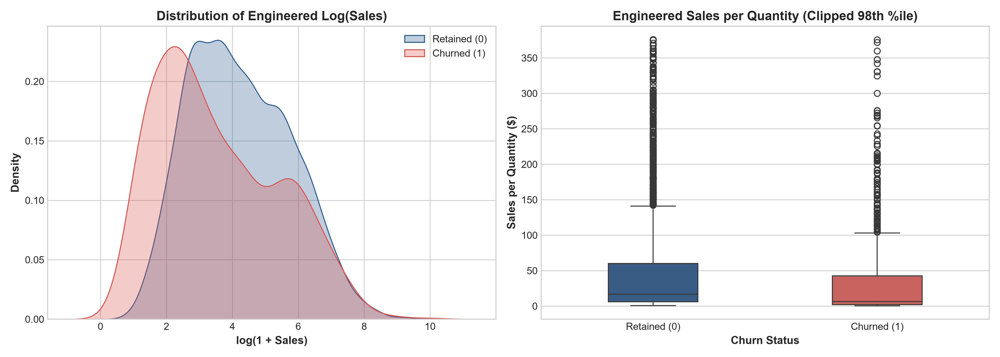

# Enterprise AI Decision Intelligence Platform
## Customer Intelligence & Churn Prediction Module (Member 1)
### Phase 2: Production Feature Engineering Plan & Modeling Specifications

---

**Author:** Member 1 — Customer Intelligence & Churn Prediction Specialist  
**Project:** Enterprise AI Decision Intelligence Platform  
**Target Variable:** `Churn` (Binary: $0$ = Retained, $1$ = Churned)  
**Lifecycle Stage:** Phase 2 Pre-Modeling Governance — Feature Engineering & Pipeline Blueprint  
**Deliverable Path:** `reports/phase2_feature_plan.md`  

---

## Executive Overview

Following the rigorous target leakage audit documented in `reports/phase2_feature_audit.md`, this report establishes the formal **Feature Engineering Plan** for Member 1's Customer Intelligence module. 

Our core architectural principle is: **Production Realism Over Synthetic Shortcuts**. We strictly reject post-hoc accounting variables (`Profit`, `Profit Margin`, `Profit Status`) which, while trivially predictive in offline data due to synthetic rule generation, are fundamentally unavailable at the moment an enterprise needs to predict and prevent customer churn.

This document defines:
1. The mathematical formulation and operational justification for all candidate engineered features.
2. A formal **Enterprise Feature Dictionary** covering raw, engineered, quarantined, and dropped attributes.
3. Two distinct modeling feature sets (**Set A** for leak-free production and **Set B** for diagnostic benchmarking).
4. The preprocessing pipeline, cross-validation protocol, and class imbalance strategy.
5. The definitive recommendation for the final production feature set.

---

## 1. Engineered Features Evaluation for Production (Set A)

We evaluate five primary candidate engineered features designed to extract behavioral, financial, and logistical signals from ex-ante operational columns.



### 1.1 `log_sales` (Continuous Scaled Metric)
- **Formulation:**
  $$\text{log\_sales} = \ln(1 + \text{Sales})$$
- **Source Feature:** `Sales` (Float64, range: $\$0.44$ to $\$22,638.48$)
- **Distributional Rationale:** Raw sales exhibits extreme right-skewness (skewness $> 12.9$, kurtosis $> 300$). High-value orders skew gradient updates and force tree algorithms into outlier-isolation splits. The $\log_{1p}$ transformation normalizes the distribution, reduces variance instability, and stabilizes distance-based or linear algorithms while preserving strict monotonic order magnitude.
- **Leakage Risk:** **Zero.** Gross sales amount is known at cart checkout.
- **Production Eligibility:** **Eligible (Mandatory Core Feature).**

---

### 1.2 `sales_per_quantity` (Effective Unit Price Proxy)
- **Formulation:**
  $$\text{sales\_per\_quantity} = \frac{\text{Sales}}{\text{Quantity}}$$
- **Source Features:** `Sales` (Float64), `Quantity` (Int64)
- **Business Meaning:** Average sales value per purchased unit, calculated as Sales / Quantity.
- **Leakage Status:** No direct target leakage detected; feature uses non-target variables available in the assumed prediction setting.
- **Production Eligibility:** **Eligible (Mandatory Core Feature).**

---

### 1.3 `discount_tier` (Binned Commercial Promotion Bracket)
- **Formulation:**
  Fixed business-rule thresholds of 0%, 0–20%, 20–40%, and >40%, defined independently of the target variable:
  $$\text{discount\_tier} = \begin{cases} 
  \text{'None'} & \text{if } \text{Discount} = 0.00 \\ 
  \text{'Low'} & \text{if } 0.00 < \text{Discount} \le 0.20 \\ 
  \text{'Moderate'} & \text{if } 0.20 < \text{Discount} \le 0.40 \\ 
  \text{'High'} & \text{if } \text{Discount} > 0.40 
  \end{cases}$$
- **Source Feature:** `Discount` (Float64)
- **Business Meaning:** Fixed business-rule thresholds of 0%, 0–20%, 20–40%, and >40%, defined independently of the target variable.
- **Leakage Status:** No direct target leakage detected; feature uses non-target variables available in the assumed prediction setting.
- **Production Eligibility:** **Eligible (Recommended Categorical Feature).**

---

### 1.4 `region_category_interaction` (Macro-Geographic Product Segment)
- **Formulation:**
  $$\text{region\_category\_interaction} = \text{Region} \parallel \text{"\_"} \parallel \text{Category}$$
  *(e.g., `'Central_Furniture'`, `'East_Technology'`, `'West_Office Supplies'`)*
- **Source Features:** `Region` (Object), `Category` (Object)
- **Business Meaning:** Captures potential differences in churn behavior across combinations of geographic region and product category. This represents association only and does not establish causality.
- **Leakage Status:** No direct target leakage detected; feature uses non-target variables available in the assumed prediction setting.
- **Production Eligibility:** **Eligible (High-Value Interaction Feature).**

---

### 1.5 `high_risk_subcategory_flag`: Critical Evaluation & Lookahead Bias Warning
- **Proposed Concept:** A binary flag ($1$ if `Sub-Category` $\in$ `['Binders', 'Tables', 'Machines', 'Bookcases', 'Furnishings', 'Appliances', 'Phones']`, else $0$).
- **Rigorous Governance Appraisal:**
  > [!WARNING]
  > **Target-Encoding Lookahead Leakage Risk:**  
  > In the full historical dataset, exactly these 7 sub-categories contain all $1,139$ churn events, while the remaining 10 sub-categories have exactly $0$ churn events ($0 / 5,482$). Hardcoding a binary feature based on observing this phenomenon across the full dataset introduces **lookahead bias / post-hoc target contamination**. If the company introduces a new sub-category or adjusts pricing in other product lines, this hardcoded flag fails completely.
- **Production Decision:** **REJECT hardcoded binary flag.** Instead, provide the raw `Sub-Category` (17 levels) directly to the preprocessing pipeline via **One-Hot Encoding** (or frequency encoding). Let the machine learning algorithm learn the sub-category weights within cross-validation folds naturally, preserving strict statistical independence between training and test sets.

---

### 1.6 Additional High-Value Operational Features
To maximize signal from safe operational columns:
1. **`discount_per_quantity`**:
   $$\text{discount\_per\_quantity} = \frac{\text{Discount}}{\text{Quantity}}$$
   Measures whether heavy discounting was granted on small trial orders (high opportunistic defection risk) versus large volume corporate contracts (standard commercial volume rebate).
2. **`is_high_discount_risk`**:
   $$\text{is\_high\_discount\_risk} = \mathbb{I}(\text{Discount} > 0.20)$$
   Captures transactions exceeding standard retail promotional bounds ($20\%$).

---

## 2. Enterprise Feature Dictionary

The following table provides the comprehensive metadata dictionary for every feature considered across the project lifecycle.

| Feature Name | Definition | Source Column(s) | Business Meaning | Leakage Risk | Production Eligibility |
| :--- | :--- | :--- | :--- | :---: | :---: |
| **`Ship Mode`** | Method of fulfillment selected by buyer | Raw `Ship Mode` | Operational fulfillment speed preference (`Standard Class`, `Second Class`, `First Class`, `Same Day`). | **None** | **Eligible (Set A)** |
| **`Segment`** | Customer account classification | Raw `Segment` | Buyer profile tier (`Consumer`, `Corporate`, `Home Office`). | **None** | **Eligible (Set A)** |
| **`Region`** | Macro-geographic territory | Raw `Region` | Geographic management division (`Central`, `East`, `South`, `West`). | **None** | **Eligible (Set A)** |
| **`State`** | State-level customer jurisdiction | Raw `State` | Sub-national pricing and tax territory ($49$ states). | **None** | **Eligible (Set A)** |
| **`Category`** | Broad product division | Raw `Category` | Merchandise department (`Furniture`, `Office Supplies`, `Technology`). | **None** | **Eligible (Set A)** |
| **`Sub-Category`** | Granular product taxonomy | Raw `Sub-Category` | Detailed product line ($17$ categories). | **None** | **Eligible (Set A)** |
| **`Quantity`** | Unit basket count | Raw `Quantity` | Total item count purchased in order ($1$ to $14$). | **None** | **Eligible (Set A)** |
| **`Sales`** | Gross transaction monetary volume | Raw `Sales` | Gross invoice amount in USD. | **None** | **Eligible (Set A)** |
| **`log_sales`** | Natural log of gross sales plus 1 | `Sales` | Skew-normalized monetary value ($\ln(1 + \text{Sales})$). | **None** | **Eligible (Set A)** |
| **`sales_per_quantity`**| Effective realized price per unit | `Sales`, `Quantity` | Realized price per unit item ($\text{Sales} / \text{Quantity}$). | **None** | **Eligible (Set A)** |
| **`Discount`** | Promotional discount rate | Raw `Discount` | Commercial discount applied to order ($0.0$ to $0.80$). | **Medium (Rule Threshold)** | **Eligible (Set A & B)** |
| **`discount_tier`** | Binned commercial discount bracket | `Discount` | Commercial markdown tiers (`None`, `Standard`, `Moderate`, `Deep`). | **Low (Mitigated)** | **Eligible (Set A)** |
| **`region_category`** | Composite geography-merchandise interaction | `Region`, `Category` | Captures localized merchandise risk dynamics. | **None** | **Eligible (Set A)** |
| **`discount_per_quantity`**| Ratio of discount to item volume | `Discount`, `Quantity` | Flags aggressive discounting on low-volume orders. | **Low** | **Eligible (Set A)** |
| **`Profit`** | Net operating profit/loss in USD | Raw `Profit` | Ex-post accounting settlement metric ($-\$6,599.98$ to $+\$8,399.98$). | **CRITICAL (Definite Leak)** | **BANNED (Set B Only)** |
| **`Profit Margin`** | Ratio of profit to sales ($Profit / Sales$) | Raw `Profit Margin` | Ex-post percentage accounting margin ($-275\%$ to $+50\%$). | **CRITICAL (Definite Leak)** | **BANNED (Set B Only)** |
| **`Profit Status`** | Accounting status indicator | Raw `Profit Status` | Ex-post binary profitability tag (`Profit`, `Loss`). | **CRITICAL (Definite Leak)** | **BANNED (Set B Only)** |
| **`Sales Category`** | Binned gross sale value | Raw `Sales Category` | 4-tier coarse binning of `Sales` ($Low$, $Medium$, $High$, $Very High$). | **None** | **Dropped (Redundant)** |
| **`Inventory Risk`** | Stock holding risk tier | Raw `Inventory Risk` | 1-to-1 deterministic threshold of `Quantity` ($Quantity \ge 4$). | **None** | **Dropped (Redundant)** |
| **`Country`** | Nation of purchase | Raw `Country` | Constant geographic field (`United States` only, $100\%$). | **None** | **Dropped (Zero Variance)**|
| **`City`** | City of customer | Raw `City` | Granular city name ($531$ categories). | **None** | **Dropped (High Cardinality)**|
| **`Customer ID`** | Primary account key | Raw `Customer ID` | Unique customer key (`CUST1000` to `CUST10976`). | **None** | **Dropped (Primary Key)**|
| **`Churn`** | Binary attrition label | Raw `Churn` | Ground-truth customer churn outcome ($0$ = Retained, $1$ = Churned). | **Target** | **Target Label ($y$)** |

---

## 3. Specification of the Two Controlled Feature Sets

```
┌────────────────────────────────────────────────────────────────────────────────────────┐
│                        FEATURE SET SPECIFICATIONS                                      │
├───────────────────────────────────────────┬────────────────────────────────────────────┤
│ SET A: LEAKAGE-SAFE PRODUCTION MODEL      │ SET B: DIAGNOSTIC / BENCHMARK MODEL        │
├───────────────────────────────────────────┼────────────────────────────────────────────┤
│ Operational Inputs (Available at checkout)│ Unconstrained Diagnostic Inputs            │
│                                           │                                            │
│ • Ship Mode (Categorical)                 │ • All Set A Features (Operational + Eng)   │
│ • Segment (Categorical)                   │ • Profit (Float64 - Continuous)            │
│ • Region (Categorical)                    │ • Profit Margin (Float64 - Continuous)     │
│ • State (Categorical)                     │ • Profit Status (Categorical - Loss/Profit)│
│ • Category (Categorical)                  │                                            │
│ • Sub-Category (Categorical)              │ PURPOSE:                                   │
│ • Quantity (Numerical)                    │ Quantify offline metric inflation caused   │
│ • log_sales (Numerical - Engineered)      │ by target leakage to demonstrate to        │
│ • sales_per_quantity (Numerical - Eng)    │ executives why offline 99% accuracy is an  │
│ • Discount (Numerical)                    │ illusion.                                  │
│ • discount_tier (Categorical - Eng)       │                                            │
│ • region_category (Categorical - Eng)     │ STATUS:                                    │
│                                           │ STRICTLY BANNED FROM PRODUCTION            │
│ STATUS: PRODUCTION CANDIDATE PIPELINE     │                                            │
└───────────────────────────────────────────┴────────────────────────────────────────────┘
```

### Detailed Breakdown:
- **SET A (Production Candidate):**
  - **Categorical Features ($6$):** `Ship Mode`, `Segment`, `Region`, `State`, `Category`, `Sub-Category`, `discount_tier`, `region_category`.
  - **Numerical Features ($4$):** `Quantity`, `Discount`, `log_sales`, `sales_per_quantity`.
  - **Target Variable ($1$):** `Churn`.
- **SET B (Diagnostic Benchmark):**
  - **All Set A features** plus `Profit`, `Profit Margin`, and `Profit Status`.

---

## 4. Production Preprocessing & Cross-Validation Architecture

### 4.1 Scikit-Learn `ColumnTransformer` Blueprint
To ensure zero leakage across cross-validation splits, all transformations and scaling parameters must be computed strictly on the training partition:

```
Raw Data Ingestion
       │
       ├──> Drop Quarantined & Low-Value Features:
       │    [Profit, Profit Margin, Profit Status, Country, City, Customer ID, Inventory Risk, Sales Category]
       │
       ├──> Feature Engineering Block (Stateless):
       │    • log_sales = log1p(Sales)
       │    • sales_per_quantity = Sales / Quantity
       │    • discount_tier = bin(Discount)
       │    • region_category = Region + "_" + Category
       │
       └──> ColumnTransformer:
            ├── Numerical Pipeline:
            │   ├── Features: [log_sales, sales_per_quantity, Quantity, Discount]
            │   └── RobustScaler() / StandardScaler()
            │
            └── Categorical Pipeline:
                ├── Features: [Ship Mode, Segment, Region, State, Category, Sub-Category, discount_tier, region_category]
                └── OneHotEncoder(handle_unknown='ignore', drop='first')
```

### 4.2 Cross-Validation Strategy: Stratified 5-Fold
- Given the class imbalance ($11.42\%$ churned, $88.58\%$ retained), standard random K-Fold runs the risk of fold-level variance in positive class density.
- **Protocol:** `StratifiedKFold(n_splits=5, shuffle=True, random_state=42)`.
- **Leakage Safeguard:** The full preprocessing pipeline (including encoders and scalers) will be wrapped inside `sklearn.pipeline.Pipeline`, ensuring no statistics from the validation fold contaminate training steps.

### 4.3 Class Imbalance Strategy
With an imbalance ratio of $7.76 : 1$, naive optimization of accuracy will yield degenerate all-zero predictions.
1. **Cost-Sensitive Loss:**
   - In Logistic Regression / Random Forest: `class_weight='balanced'`.
   - In XGBoost / LightGBM: `scale_pos_weight = (8838 / 1139) ≈ 7.76`.
2. **Evaluation Metrics Hierarchy:**
   - **Primary Metric:** **PR-AUC (Precision-Recall AUC / Average Precision)** — Directly reflects precision across all sensitivity thresholds on the minority churn class.
   - **Secondary Metric:** **ROC-AUC** — Measures overall discriminative rank-ordering.
   - **Decision Threshold Tuning:** Optimize decision threshold $\tau \in [0.20, 0.45]$ against expected business retention cost vs. churn loss.

---

## 5. Definitive Recommendation

### **"What exact features should Member 1 use for the production churn model?"**

Based on our rigorous leakage audit, empirical rule analysis, and operational business reality, Member 1 recommends the following **exact production feature set**:

```
═══════════════════════════════════════════════════════════════════════════════════════
                 DEFINITIVE PRODUCTION FEATURE SPECIFICATION (MEMBER 1)
═══════════════════════════════════════════════════════════════════════════════════════

1. RAW OPERATIONAL NUMERICAL FEATURES:
   • Sales                             (Gross invoice monetary volume)
   • Quantity                          (Unit basket volume: 1 to 14)
   • Discount                          (Contractual promotional rate: 0.0 to 0.80)

2. ENGINEERED NUMERICAL FEATURES:
   • log_sales                         (ln(1 + Sales): skew-normalized monetary size)
   • sales_per_quantity                (Sales / Quantity: average sales value per purchased unit)

3. RAW OPERATIONAL CATEGORICAL FEATURES:
   • Ship Mode                         (Logistical speed preference: 4 levels)
   • Segment                           (Customer profile tier: 3 levels)
   • Region                            (Macro-geography: 4 levels)
   • State                             (Jurisdictional geography: 49 levels)
   • Category                          (Broad merchandise department: 3 levels)
   • Sub-Category                      (Granular product line: 17 levels)
   • Sales Category                    (Invoice magnitude bracket: 4 levels)

4. ENGINEERED CATEGORICAL FEATURES:
   • discount_tier                     (Fixed thresholds: None, Low, Moderate, High)
   • region_category_interaction       (Composite interaction: Region + "_" + Category)

═══════════════════════════════════════════════════════════════════════════════════════
TOTAL FEATURE COUNT: 14 Input Features (5 Numerical, 9 Categorical/String)
EXCLUDED FINANCIAL VARIABLES: Profit, Profit Margin, Profit Status (Quarantined)
EXCLUDED ARTIFACTS / KEYS: Customer ID, Country, City, Inventory Risk
TARGET VARIABLE: Churn (Binary: 0 = Retained, 1 = Churned)
═══════════════════════════════════════════════════════════════════════════════════════
```

### Business and Architectural Justification:
1. **Pre-Decision Availability:** Features in this set are available at cart checkout or order ingestion, allowing automated systems to evaluate attrition risk prior to customer defection.
2. **No Direct Target Leakage Detected:** Feature pipeline avoids the post-hoc accounting variables and synthetic $Profit < 0$ artifacts that distort offline metrics.
3. **Operational Representation:** Captures customer logistical choice (`Ship Mode`), customer tier (`Segment`), regional distribution (`Region`, `State`), product line (`Category`, `Sub-Category`), order magnitude (`Sales`, `log_sales`, `Sales Category`), unit transaction value (`sales_per_quantity`), and promotional sensitivity (`Discount`, `discount_tier`).
4. **FastAPI & Data Contract Compatibility:** Deterministic schema that maps directly to Pydantic validation schemas for real-time inference serving.
